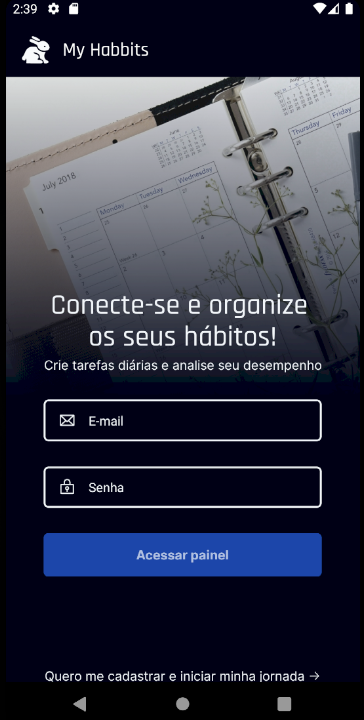
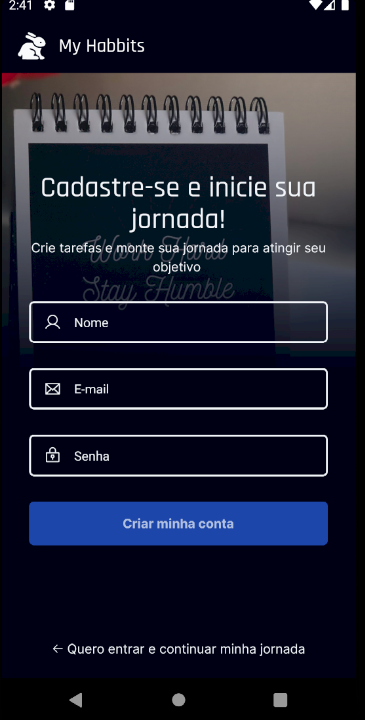

# My Habbits App

This is a habit-building app called My Habbits. The app uses the My Habbits API which is currently under development. [My Habbits API](https://github.com/LUKASRIB15/My-habbits-API).

## Setup Environment

Project created with React Native and Expo.[See official docs](https://docs.expo.dev) to set up the environment. Project using expo router, so it's important to know about this feature.

## Run Project

In this moment, my habbits is working in Android OS. Use this project with your api. Read the documentation about more.

**Install dependencies**

```

$ npm install

```

**Run Android**

```

$ npx expo run:android

```

## Run tests

This project uses component testing and e2e testing to improve software quality. To perform these tests, follow these instructions:

**Component tests**

```

$ npm run test
$ npm run test:cov // Generate coverage folder

```

**E2E Tests**

In e2e tests, the maestro library is being used. It is necessary to install its CLI on your machine, so access its documentation to do this process: [Maestro Docs](https://docs.maestro.dev)

OBS: To run this command, first check if you are running your project "npx expo run:android" and if you have an emulator activated.

```

$ npm run test:e2e

```

## 🛠 Tech and Libraries

- [React Native](https://reactnative.dev/)
- [TypeScript](https://www.typescriptlang.org/)
- [Expo Router](https://docs.expo.dev/versions/latest/sdk/router/): Routing and navigation
- [Async Storage](https://react-native-async-storage.github.io/async-storage/): Data storage system
- [Axios](https://github.com/axios/axios): Promise based HTTP client
- [React Native Reanimated](https://docs.swmansion.com/react-native-reanimated/): Animation and interaction

<div style="display: inline_block"><br>
  
  
  
</div>

### App Screenshots

|                 |                   Android                    |
| :-------------: | :------------------------------------------: | 
|  Sign In Screen |   |   
|  Sign Up Screen |   | 
